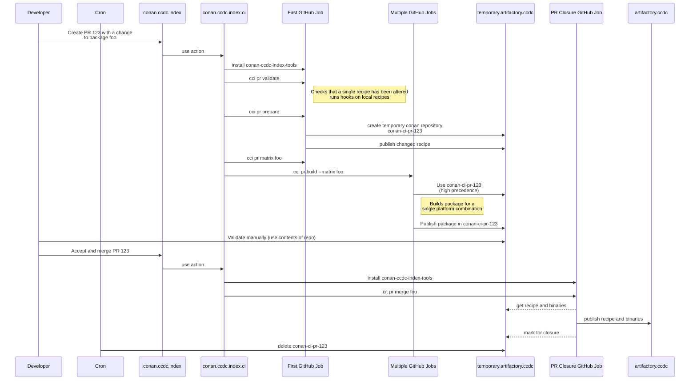

# CCDC conan index tools

Python tools and scripts for dealing with conan-ccdc-index

## Usage

Create a venv then, in the venv

```shell
python -m pip install -U pip setuptools
python -m pip install -e .
```

This will make the cit command available in the current virtualenv

Additionally running `python -m pip install -e '.[testing]'` will add some development packages 

## Ideas for the command line

Note: These are not implemented yet!

### List all package names

`cit info package`

Returns a list of package names

### List all package licences

`cit info licence`

Returns a dictionary of package names and relative licence obtained from the conanfile.py

### Get licence of a specific package

`cit info licence foo`

Returns a dictionary of package names and relative licence obtained from the conanfile.py

### Build a single version of package foo in a single platform combination and type

`cit build --build-type Release --platform-combination native-centos7-gcc10-x86_64 foo 1.2.3`

Uses a published recipe (see cit publish recipe examples below)

### Build all versions of package foo in a single platform combination and type

`cit build --build-type Release --platform-combination native-centos7-gcc10-x86_64 foo`


### Build all versions of foo in a single platform combination in all specified types (Release, Debug etc)

`cit build --platform-combination native-centos7-gcc10-x86_64 foo`

### Increase logging level

`cit --conan-logging-level debug build --build-type Release --platform-combination native-centos7-gcc10-x86_64 foo`

Valid values are "critical", "error", "warning", "warn", "info", "debug"

### Use local directory for combination install

`cit build --build-type Release --platform-combination native-centos7-gcc10-x86_64 --configuration-local-directory ../conan-ccdc-common-configuration foo`

Useful when making profile changes, an alternative to creating a branch in the configuration repository and pointing at it via alternative branches

### Publish recipes for all versions of foo in the local conan home

`cit publish recipe foo`

Unlike the version using --destination-repository, this merely publishes the recipes locally

### Publish recipes for all versions of foo

`cit publish recipe --destination-repository pr-repo-1234 foo`

Publishes a recipe to a remote repository

### Publish built package for a single version of foo

`cit publish package --destination-repository pr-repo-1234 --build-type Release --platform-combination native-centos7-gcc10-x86_64 foo 1.2.3`

### Publish built package for all versions of foo in the index

`cit publish package --destination-repository pr-repo-1234 --build-type Release --platform-configuration native-centos7-gcc10-x86_64 foo`

### Github PR validation

`cit pr validate`

- Checks that a single recipe has been altered
- potentially runs hooks on local recipes

### Github PR prepare

`cit pr prepare`

- Sets up a new conan repository for the pull request where built recipes and artefacts are stored

### Github PR create build matrix

`cit pr matrix foo`

Prints a JSON encoded matrix of GitHub jobs required to build all versions

### Github PR build

`cit pr build --matrix '{}' foo`

Builds a single matrix line

### Github PR merge

`cit pr merge foo`

Copies created artefacts to target repository. Marks conan repository as closed

### Github PR close

`cit pr close foo`

Marks conan repository as closed


## What does the PR workflow look like?

